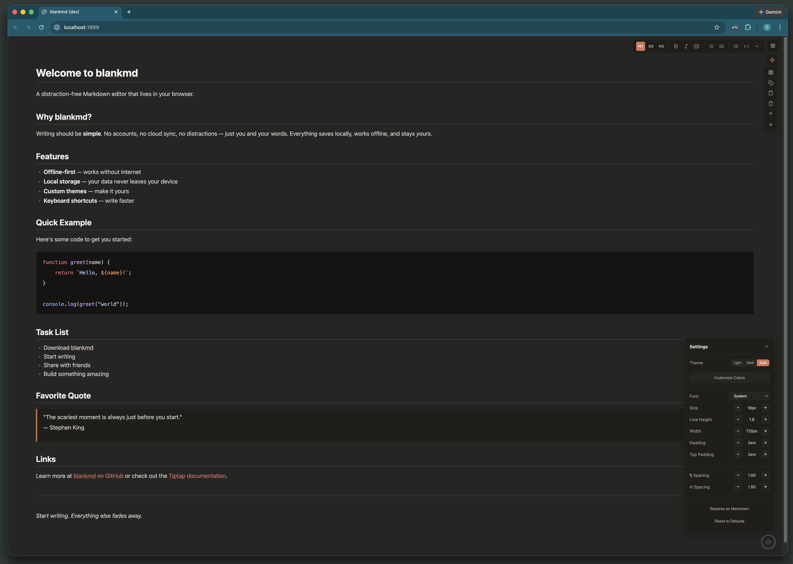
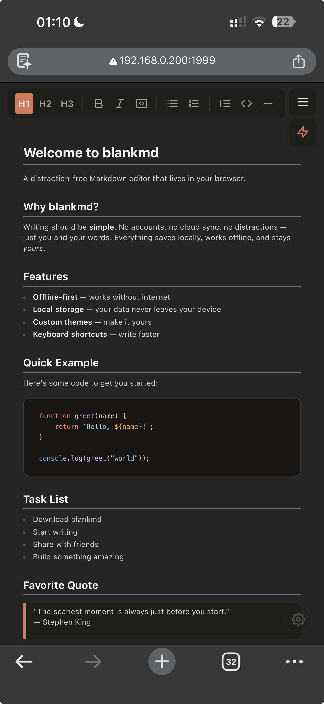
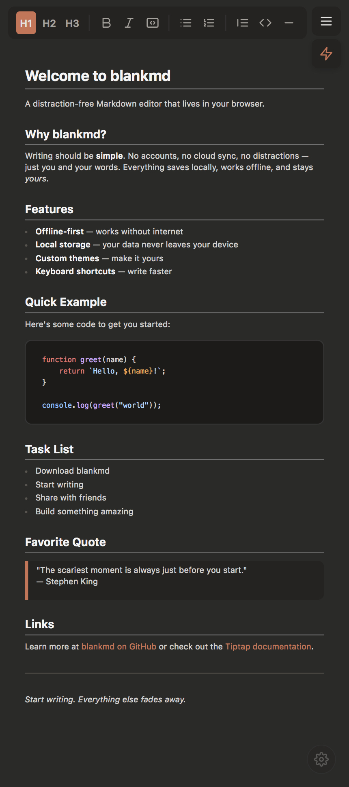

# blankmd

A markdown editor that lives in a single HTML file.

[](https://github.com/yacqu/blankmd/releases)
[](LICENSE)

## Why

I spend a lot of time brainstorming with LLMs, editing prompts, and cleaning up markdown outputs. I wanted a lightweight markdown editor I could just open in a browser tab — no VS Code, no Notion, no signing into anything. Something I could keep open alongside my conversations and just write in.

Everything out there was either too heavy, needed an internet connection, or wanted me to make an account. So I built this. It compiles down to a single HTML file. You open it, you write, it saves to localStorage. That's it.

It's not perfect and it's not trying to be. It's just useful enough for what I need. If other people end up using it and want things added, I'm happy to make it better.

* **Single file** — one HTML file, everything is inlined
* **Private** — nothing leaves your browser, content stays in localStorage
* **Fast** — no network requests, loads instantly
* **Works offline** — runs anywhere you have a browser
* **Customizable** — fonts, themes, spacing, all built in

## Screenshots



<p align="center">
  
  
</p>

This whole project was honestly a procrastination from what I should have actually been working on. But here we are.

Bun is actually awesome though. No config bullshit, the build script is like 50 lines — it just calls `Bun.build()`, reads the CSS, and stitches together one HTML file. That's the entire build. The dev server was basically one function call.
The rest of the codebase came together pretty easily too. The whole UI is built with a small set of helper functions in `components.ts` — stuff like `createElement`, `createButton`, `createStepper`, `createRow`. 
No framework, no JSX, just plain DOM helpers that compose together. It kept things really consistent without needing to reach for React or anything like that.

## Getting started

Grab the latest `index.html` from the [Releases page](https://github.com/yacqu/blankmd/releases), or try it in the browser at the [GitHub Pages demo](https://yacqu.github.io/blankmd).

Then just open the file and start writing. Your content auto-saves. No installation, no accounts.

## Development

You'll need [Bun](https://bun.sh).

```bash
git clone https://github.com/yacqu/blankmd.git
cd blankmd
bun install
```

Dev server with hot reloading:

```bash
bun run dev
```

Opens at [http://localhost:1999](http://localhost:1999)

Build the single-file `dist/index.html`:

```bash
bun run build
```

Or output it somewhere specific:

```bash
bun run build --output ~/Desktop/my-editor.html
```

## Project structure

```
blankmd/
├── src/
│   ├── index.ts           # Main entry point
│   ├── types.ts           # TypeScript interfaces
│   ├── styles.css         # All styles
│   ├── config/
│   │   ├── index.ts       # Config exports
│   │   ├── defaults.ts    # Default settings & constants
│   │   └── themes.ts      # Light/dark theme tokens
│   ├── core/
│   │   ├── index.ts       # Core exports
│   │   ├── editor.ts      # Editor setup & lifecycle
│   │   ├── extensions.ts  # Custom Tiptap extensions
│   │   └── storage.ts     # Storage abstraction
│   └── ui/
│       ├── index.ts       # UI exports
│       ├── icons.ts       # SVG icon components
│       ├── components.ts  # Reusable UI helpers
│       ├── toolbar.ts     # Toolbar component
│       └── settings.ts    # Settings panel
├── scripts/
│   ├── build.ts           # Production build
│   └── dev.ts             # Dev server
├── dist/
│   └── index.html         # Built output (gitignored)
└── package.json
```

## Extending

If you want to hack on it, the code is pretty straightforward to extend.

### Custom toolbar buttons

```typescript
import { createToolbarItem, defaultToolbarItems } from "blankmd";

const customButton = createToolbarItem({
  id: "custom",
  icon: "<svg>...</svg>",
  title: "Custom Action",
  action: (editor) => editor.chain().focus().insertContent("Hello!").run(),
});

// Add to toolbar
initToolbar(editor, {
  items: [...defaultToolbarItems, customButton],
});
```

### Custom themes

```typescript
import type { ThemeTokens } from "blankmd";

const customTheme: ThemeTokens = {
  bgEditor: "#1a1b26",
  // ... other tokens
};
```

## What's next

Things I'd like to add at some point:

- **Theme import/export** — share custom themes
- **File save/upload** — export and import markdown files
- **Multiple documents** — organize different files in browser storage

No promises on timelines. If you run into something broken or annoying, open an issue. That's the fastest way to get me to fix things.

## Built with

* [Tiptap](https://tiptap.dev) — headless rich-text editor
* [ProseMirror](https://prosemirror.net) — core editing framework
* [lowlight](https://github.com/wooorm/lowlight) — syntax highlighting
* [Bun](https://bun.sh) — build tooling

## License

MIT
